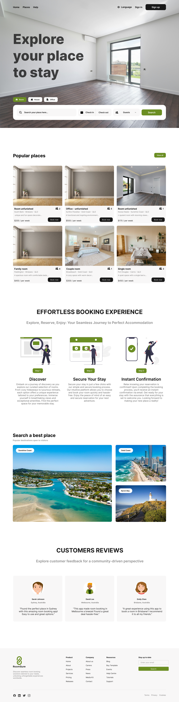

# Roomsure Booking Platform

Welcome to the Roomsure Booking Platform frontend repository. This project is part of a coding challenge for the GoLogic company. It aims to provide users with an intuitive interface for renting rooms and managing bookings seamlessly. Built with Vite and Tailwind CSS, the frontend offers a modern and responsive design.

## Figma Prototype

  

## Technologies Used
- **Vite**: A fast development server and bundler for modern web development.
- **Tailwind CSS**: A utility-first CSS framework for creating custom designs quickly.

## Environment Variables
Before running the frontend application, you need to configure the following environment variables:

| Variable              | Description                                        |
| --------------------- | -------------------------------------------------- |
| VITE_API_URL          | URL for integrating with the API.                  |
| VITE_GATEWAY_PAYMENT_URL | URL for integrating with the payment gateway.   |

Make sure to set these environment variables properly before starting the frontend application.

## Getting Started
To get started with the Roomsure Booking Platform frontend, follow these steps:
1. Clone this repository.
2. Install dependencies using `npm install`.
3. Set up the environment variables.
4. Run the development server using `npm run dev`.

## TODO
Here are some tasks to further enhance the frontend:
- Componentize elements for better reusability.
- Standardize theme configuration.
- Implement responsiveness for various devices.
- Improve search page usability.
- Add image carousels to cards.
- Incorporate more animations for a lively user experience.
- Implement a payment intention step to validate product availability.
- Add pagination on the frontend only; the API already covers it.
- Add filters for startDate, endDate, and guests on the frontend.

Feel free to contribute to these tasks and help make the Roomsure Booking Platform frontend even better!

## Contact
For any inquiries or feedback, please contact us at matheusmmelchiades@gmail.com.

Thank you for contributing to Roomsure! We look forward to seeing your contributions.
